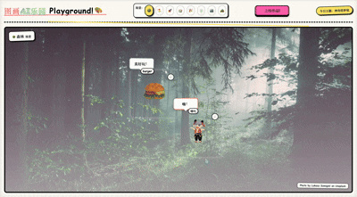
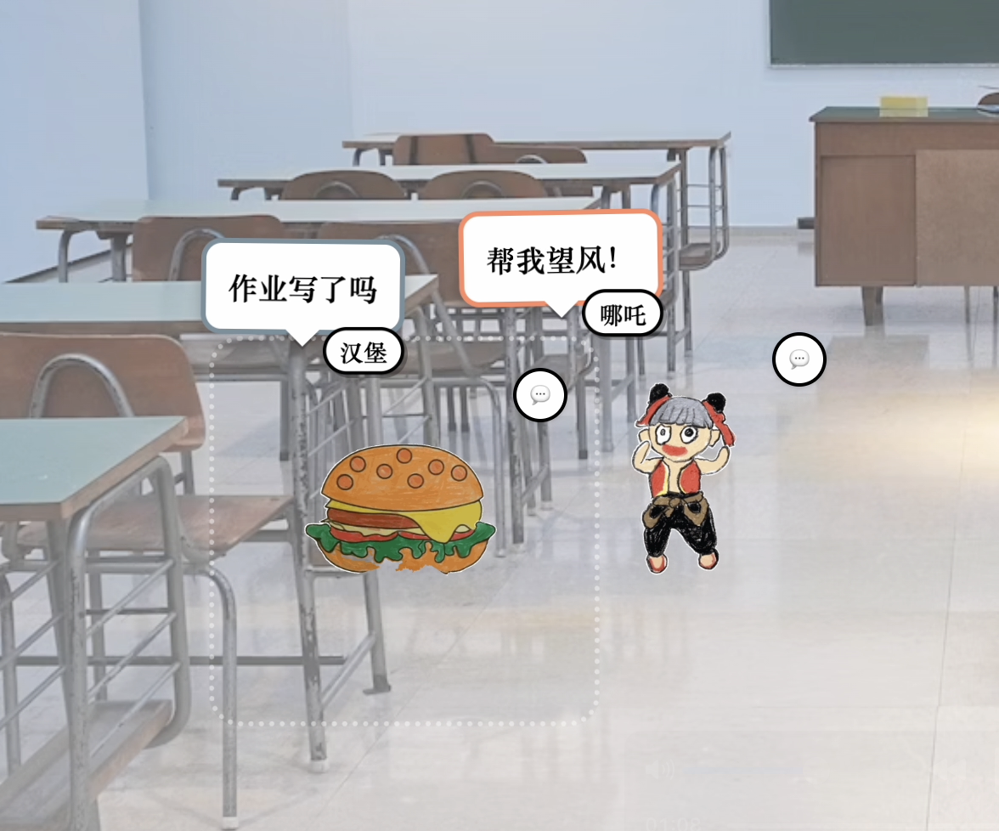
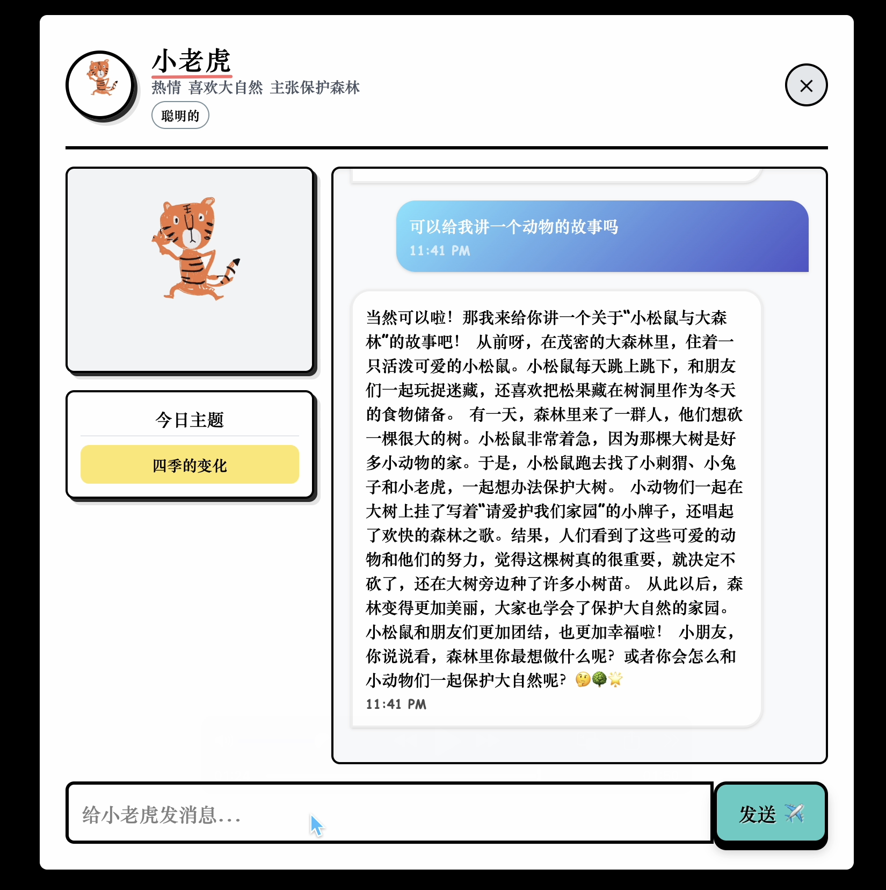

# 图画AI乐园 (Painty Dance AI)

An interactive playground where your drawings come to life, interact with each other, and respond to you through AI-powered conversations.

## Demo

https://github.com/user-attachments/assets/3405e617-e42c-4e79-afb2-3cacc1e601b2


if the video is not playing please visit: https://www.youtube.com/watch?v=dVhpT-ZqagE

## Features


- **Bring Your Drawings to Life**: Upload your drawings or images and watch them transform into animated characters
- **Interactive Environments**: Place your animated drawings in various themed scenes like forest, beach, space, and more



- **Personality-Driven Characters**: Give your creations unique personalities - friendly, curious, silly, energetic, and more
- **AI-Powered Conversations**: Characters can talk to each other and to you with context-aware conversations
- **Daily Topics**: Every day features a new conversation topic to inspire interactions
- **Group Conversation**: Place two character and more to trigger daily chat

- **Drag & Drop**: Freely position your characters around the scene
- **Chat Interface**: Open personal chat windows with any character for one-on-one conversations

## Tech Stack

- **Frontend**: React, TypeScript, TailwindCSS
- **Backend**: Node.js server for image processing
- **AI**: OpenRouter API (deepseek-v3) for generating character responses
- **Animation**: Meta Custom animation processing Model for uploaded drawings [(https://sketch.metademolab.com/)]

## Installation

### Prerequisites

- Node.js (v14 or higher)
- npm or yarn
- Backend server running on localhost:5000 (see backend repository)

### Setup

1. Clone the repository:
   ```
   git clone https://github.com/yourusername/painty-dance-ai.git
   cd painty-dance-ai
   ```

2. Install dependencies:
   ```
   cd frontend
   npm install
   ```

3. Create a `.env` file in the frontend directory with your OpenRouter API key:
   ```
   VITE_OPENROUTER_API_KEY=your_api_key_here
   ```

4. Start the development server:
   ```
   npm run dev
   ```

5. Open your browser and navigate to `http://localhost:5173`

## Usage

1. **Select a Scene**: Choose from various backgrounds using the scene selector at the top
2. **Upload a Drawing**: Click the "上传作品" button to upload your drawing or image
3. **Add Details**: Give your character a name, description, and personality
4. **Interact**: Drag your characters around, watch them talk to each other when they're close
5. **Chat**: Click the chat bubble on any character to start a one-on-one conversation

## Project Structure

```
frontend/
│
├── src/                # Source files
│   ├── components/     # React components
│   │   ├── DraggableGif.tsx     # Draggable character component
│   │   ├── ChatModal.tsx        # Chat interface
│   │   ├── UploadModal.tsx      # Upload interface 
│   │   └── SceneSelector.tsx    # Scene selection component
│   │
│   ├── constants/      # Application constants
│   ├── types/          # TypeScript type definitions
│   ├── utils/          # Utility functions
│   ├── App.tsx         # Main application component
│   └── App.css         # Styles
│
└── public/             # Static assets
```

## Backend

The backend server handles image processing to animate your static drawings. It should be running on `localhost:5000`. For more information, see the backend repository.

### Backend Setup

The backend needs to run through conda environment. Please follow these instructions to set up conda:

1. Activate the animated_drawings conda environment:
   ```
   conda activate animated_drawings
   ```

2. Ensure you're in the root directory of AnimatedDrawings:
   ```
   cd {location of AnimatedDrawings on your computer}
   ```

3. Start up a Python interpreter:
   ```
   python
   ```

### Docker Setup (Option 1)

To get it working, you'll need to set up a Docker container that runs TorchServe. This allows us to quickly show your image to our machine learning models and receive their predictions.

Follow these steps:

1. Install Docker Desktop and ensure it's running
2. Run the following commands, starting from the Animated Drawings root directory:

   ```
   cd torchserve

   # build the docker image (takes ~5-7 minutes on Macbook Pro 2021)
   docker build -t docker_torchserve .

   # start the docker container and expose the necessary ports
   docker run -d --name docker_torchserve -p 8080:8080 -p 8081:8081 docker_torchserve
   ```

## Credits

- Background images from [Unsplash](https://unsplash.com/)
- AI text generation powered by [OpenRouter](https://openrouter.ai/)
- Animation model powered by [metaAILab](https://sketch.metademolab.com/#)
## License

[MIT License](LICENSE)

---

Created for 2025 AI Challenge Cup [挑战杯官网](https://www.tiaozhanbei.net/)
